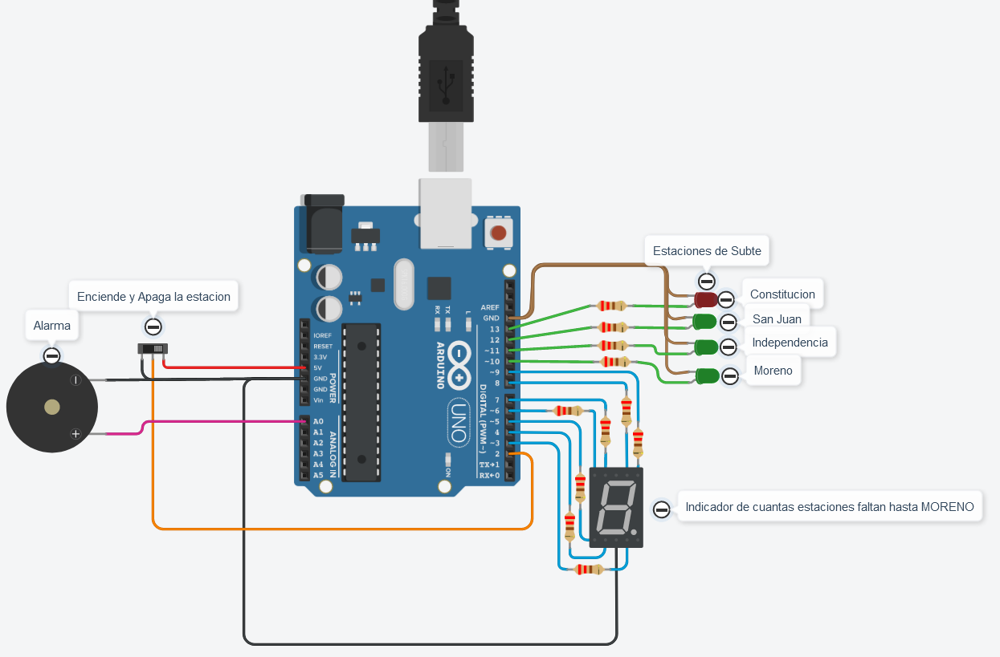

# UTN-SPD-Subtes

Resolucion del ejercicio Estaciones de Subte para la materia Sistema de Procesamiento de Datos 1E

# Ejemplo Documentación


## Integrantes

- Gustavo Adrian Arias Contreras

## Proyecto: Estaciones de Subte.



## Descripción

Este proyecto se orienta a resolver las consignas del ejercicio Estacion de Subte, el cual tiene como funcion mostrar
4 estaciones de subte a través de Led's (Constitucion, San Juan, Independencia, Moreno),
un visualizador de 7 segmentos para mostrar la cantidad de estaciones hasta Moreno y un buzzer para generar un sonido al momento de cambiar de estacion

## Función principal

Esta funcion se encarga de loopear el proyecto, en el mismo tiene unas validaciones para mostrar la estacion actual que sera para el LED el contador, mientras que para el visualizador se calcula la distancia restando el contador para obtener el numero actual que mostrar, tambien tenemos una manera de obtener los segundos para tener un intervalo en el cual se actualizaran los valores, tambien asi una flag que se utiliza para saber si se debe sumar o restar al contador

PIEZO1 esta relacionado al buzzer

```C (lenguaje en el que esta escrito)
void loop()
{
  interruptor = digitalRead(INTERRUPTOR);
  digitalWrite(PIEZO1, LOW);
  imprimir_numero(distancia - contador);
  encender_estacion(contador);
  if (interruptor == HIGH) {
    unsigned long currentMillis = millis();
    if((unsigned long)(currentMillis - previousMillis) > (segundo * cambio_estacion)){
      previousMillis = currentMillis;
      if(flag){
        contador++;
        digitalWrite(PIEZO1, HIGH);
      }
      else {
        contador--;
        digitalWrite(PIEZO1, HIGH);
      }
    }
  validar_flag(contador);
  }
}
```

## Funciones Control de leds

Estas funciones se utilizan para encender y apagar los leds respecto a la estacion solicitada por el contador calculado

LEDCONSTITUCION, LEDSANJUAN, LEDINDEPENDENCIA, LEMORENO Son los distintos Leds que representan las estaciones

```C (lenguaje en el que esta escrito)
void encender_estacion(int numero){
  apagar_leds();
  switch(numero) {
    case 1:
    	digitalWrite(LEDCONSTITUCION, HIGH);
    	break;
    case 2:
    	digitalWrite(LEDSANJUAN, HIGH);
    	break;
    case 3:
    	digitalWrite(LEDINDEPENDENCIA, HIGH);
    	break;
    case 4:
    	digitalWrite(LEMORENO, HIGH);
    	break;
  }
}

void apagar_leds(){
  digitalWrite(LEDCONSTITUCION, LOW);
  digitalWrite(LEDSANJUAN, LOW);
  digitalWrite(LEDINDEPENDENCIA, LOW);
  digitalWrite(LEMORENO, LOW);
}
```

## Función encendido visualizador

Esta funcion esta realiza para poder mostrar el numero necesario en el visualizador de 7 segmentos

LEDA, LEDB, LEDC, LEDD, LEDE, LEDF, LEDG Son los distintos leds dentro del visualizador

```C (lenguaje en el que esta escrito)
void imprimir_numero(int numero) {
  switch(numero) {
    case 0:
    	digitalWrite(LEDA, HIGH);
    	digitalWrite(LEDB, HIGH);
    	digitalWrite(LEDC, HIGH);
    	digitalWrite(LEDD, HIGH);
    	digitalWrite(LEDE, HIGH);
    	digitalWrite(LEDF, HIGH);
    	digitalWrite(LEDG, LOW);
    	break;
    case 1:
    	digitalWrite(LEDA, LOW);
    	digitalWrite(LEDB, HIGH);
    	digitalWrite(LEDC, HIGH);
    	digitalWrite(LEDD, LOW);
    	digitalWrite(LEDE, LOW);
    	digitalWrite(LEDF, LOW);
    	digitalWrite(LEDG, LOW);
    	break;
    case 2:
    	digitalWrite(LEDA, HIGH);
    	digitalWrite(LEDB, HIGH);
    	digitalWrite(LEDC, LOW);
    	digitalWrite(LEDD, HIGH);
    	digitalWrite(LEDE, HIGH);
    	digitalWrite(LEDF, LOW);
    	digitalWrite(LEDG, HIGH);
    	break;
    case 3:
    	digitalWrite(LEDA, HIGH);
    	digitalWrite(LEDB, HIGH);
    	digitalWrite(LEDC, HIGH);
    	digitalWrite(LEDD, HIGH);
    	digitalWrite(LEDE, LOW);
    	digitalWrite(LEDF, LOW);
    	digitalWrite(LEDG, HIGH);
    	break;
    case 4:
    	digitalWrite(LEDA, LOW);
    	digitalWrite(LEDB, HIGH);
    	digitalWrite(LEDC, HIGH);
    	digitalWrite(LEDD, LOW);
    	digitalWrite(LEDE, LOW);
    	digitalWrite(LEDF, HIGH);
    	digitalWrite(LEDG, HIGH);
    	break;
  }
}
```

## :robot: Link al proyecto

- [proyecto](https://www.tinkercad.com/things/8WAFusIxQCo-ejercicio-estacion-de-subte)

### Fuentes

- [Consejos para documentar](https://www.sohamkamani.com/how-to-write-good-documentation/#architecture-documentation).

- [Lenguaje Markdown](https://markdown.es/sintaxis-markdown/#linkauto).

- [Markdown Cheatsheet](https://github.com/adam-p/markdown-here/wiki/Markdown-Cheatsheet).

- [Tutorial](https://www.youtube.com/watch?v=oxaH9CFpeEE).

- [Emojis](https://gist.github.com/rxaviers/7360908).

---
